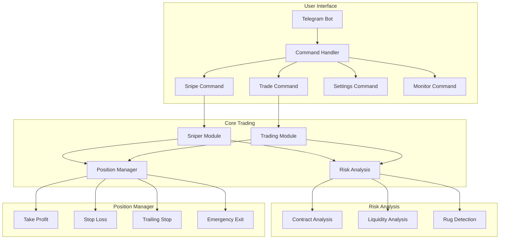

# 🤖 Trader Tony

## Overview
Trader Tony is a Solana-focused trading bot with advanced sniping capabilities and risk management, controlled through a Telegram interface.

### Key Features
- 🎯 Raydium sniping with anti-rug protection
- 📊 Regular trading capabilities
- ⚠️ Advanced risk analysis and monitoring
- 📈 Position management (Take Profit/Stop Loss)

## Architecture


## Technical Details

### Core Modules
1. **Telegram Interface**
   - Command processing
   - Alert system
   - Status monitoring

2. **Trading Engine**
   - Raydium integration
   - Transaction management
   - Position tracking

3. **Risk Analysis**
   - Contract verification
   - Liquidity monitoring
   - Pattern detection
   - Rug pull signals

4. **Position Management**
   - Take profit execution
   - Stop loss management
   - Emergency exit system

## Setup & Usage

### Prerequisites
- Python 3.9+
- Solana RPC URL
- Telegram Bot Token
- Solana Wallet

### Installation
```bash
# Clone repository
git clone <repo-url>
cd trader-tony

# Install dependencies
pip install -r requirements.txt

# Configure environment
cp .env.example .env
# Edit .env with your keys
```

### Configuration
```python
# Example configuration
SOLANA_RPC_URL="your-rpc-url"
TELEGRAM_BOT_TOKEN="your-bot-token"
WALLET_PRIVATE_KEY="your-private-key"

# Trading parameters
MIN_LIQUIDITY = 1000  # USD
MAX_SLIPPAGE = 1     # 1%
TAKE_PROFIT = 50     # 50%
STOP_LOSS = 20       # 20%
```

### Commands
- `/start` - Start the bot
- `/status` - Check bot status
- `/snipe <token> <amount>` - Snipe a token
- `/trade <token> <amount> <side>` - Place a trade
- `/position` - View current positions
- `/settings` - Configure bot settings

### Risk Management
The bot implements multiple layers of risk analysis:
- Contract code verification
- Liquidity analysis
- Trading pattern detection
- Holder distribution analysis

## Development

### Project Structure
```
trader-tony/
├── src/
│   ├── bot/           # Telegram interface
│   │   ├── __init__.py
│   │   ├── handler.py
│   │   └── commands.py
│   ├── trading/       # Trading logic
│   │   ├── __init__.py
│   │   ├── sniper.py
│   │   ├── trader.py
│   │   └── risk.py
│   └── utils/         # Shared utilities
│       ├── __init__.py
│       └── config.py
├── README.md
├── .env.example
└── requirements.txt
