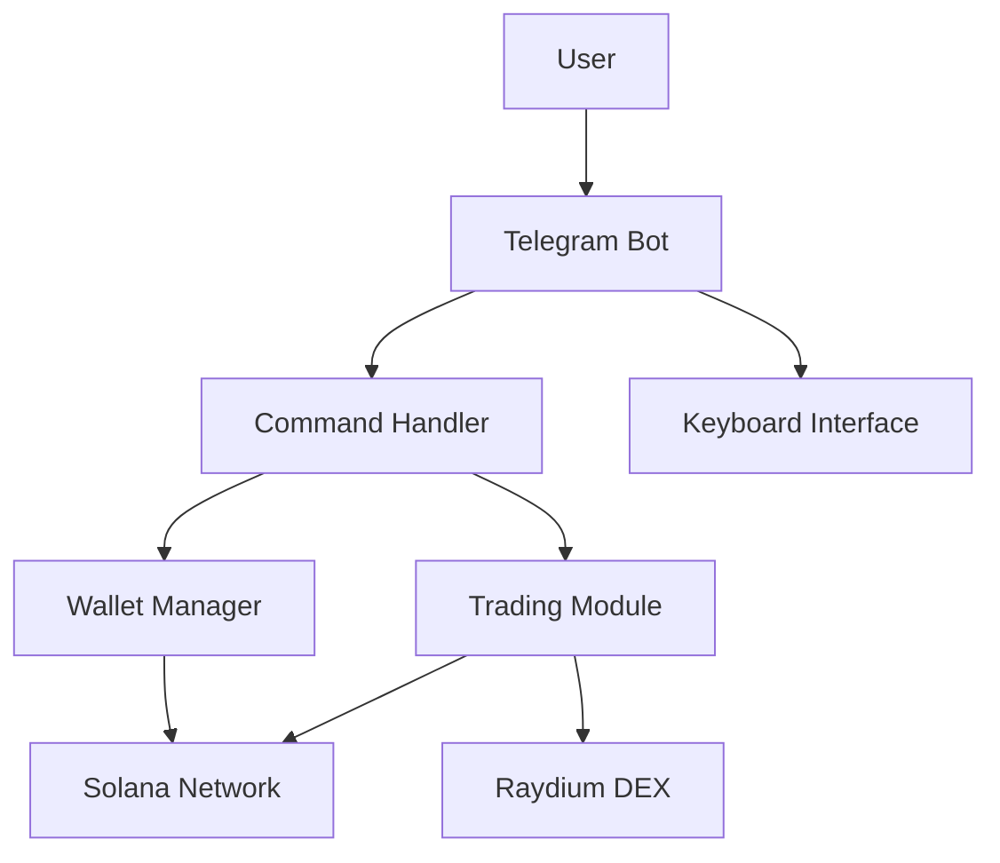
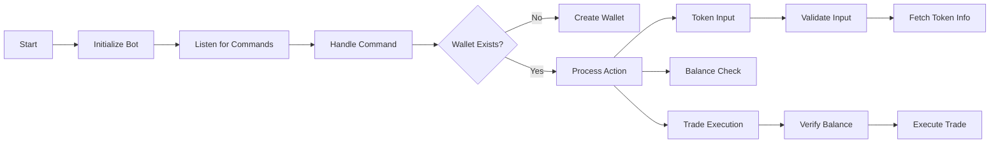
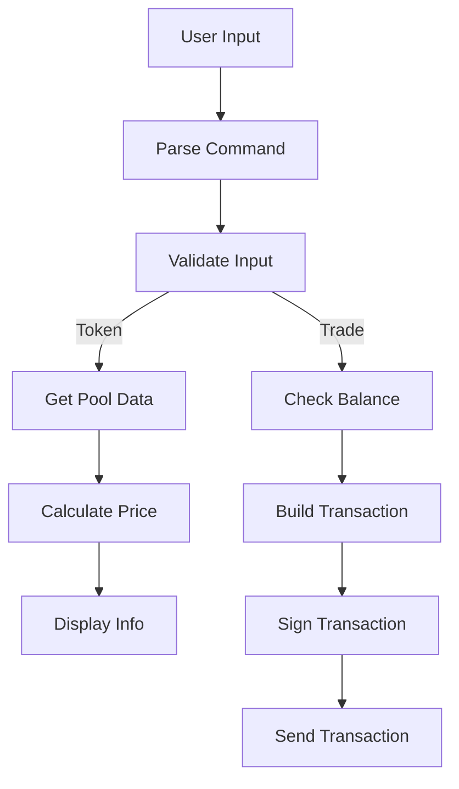
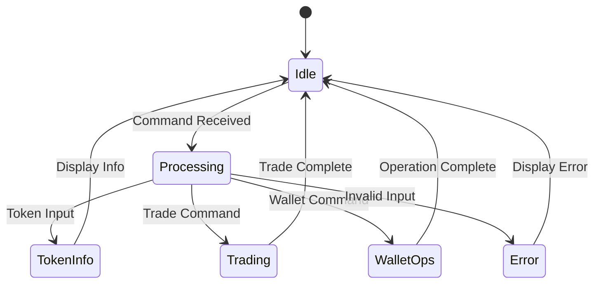

# TraderTony System Diagrams

## System Architecture



## Component Flow



## Data Flow



## State Management



## User Interaction Flow

```mermaid
sequenceDiagram
    participant User
    participant Bot
    participant Wallet
    participant DEX
    
    User->>Bot: /start
    Bot->>Wallet: Create/Load Wallet
    Wallet-->>Bot: Wallet Info
    Bot-->>User: Welcome + Address
    
    User->>Bot: Token Input
    Bot->>DEX: Get Token Info
    DEX-->>Bot: Token Data
    Bot-->>User: Token Details
    
    User->>Bot: Buy Command
    Bot->>Wallet: Check Balance
    Wallet-->>Bot: Balance OK
    Bot->>DEX: Execute Trade
    DEX-->>Bot: Trade Result
    Bot-->>User: Confirmation
