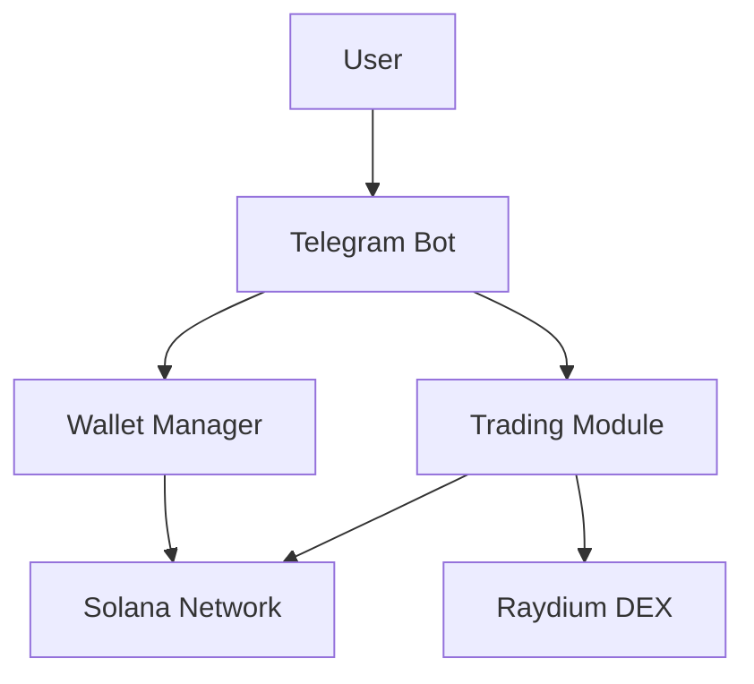

# TraderTony Bot Architecture

## Overview

TraderTony is a Telegram-based trading bot for Solana tokens, focusing on simplicity and ease of use. The bot enables users to:
- View token information
- Create and manage wallets
- Execute trades on Raydium DEX
- Monitor balances and transactions

## Core Components

### 1. Telegram Bot Interface (main.py)
- Handles user interactions
- Manages commands and keyboard interface
- Processes token URLs and addresses
- Displays token information and trading options

### 2. Wallet Management (wallet.py)
- Creates and manages Solana wallets
- Handles balance checking
- Manages transaction signing
- Provides secure key storage

### 3. Trading Module (sniper.py)
- Interfaces with Raydium DEX
- Fetches token information
- Calculates prices and liquidity
- Processes token metadata

### 4. Configuration (config.py)
- Manages environment variables
- Stores API endpoints
- Handles trading parameters

## Data Flow

## Key Features

1. Token Information
   - Price data
   - Market cap
   - Liquidity info
   - 24h volume
   - Chart links

2. Wallet Operations
   - Balance checking
   - Transaction signing
   - Address management
   - Fund deposits

3. Trading Functions
   - Token lookup
   - Price checking
   - Buy/Sell operations
   - Transaction status

## User Interface

The bot provides a simple keyboard interface with the following options:
- Buy: Enter token to purchase
- Fund: Deposit SOL to wallet
- Wallet: View wallet info
- Refresh: Update balance
- Settings: Basic configuration
- DCA/Limit Orders: Advanced trading

## Dependencies

Essential packages required:
- pyTelegramBotAPI: Telegram bot functionality
- solana: Solana blockchain interaction
- solders: Solana transaction handling
- python-dotenv: Environment configuration

## Security Considerations

1. Wallet Security
   - Secure key generation
   - Safe transaction signing
   - Balance protection

2. Trading Safety
   - Input validation
   - Transaction verification
   - Error handling

## Error Handling

The bot implements comprehensive error handling for:
- Invalid token addresses
- Failed transactions
- Network issues
- API errors
- Balance insufficiency

## Future Improvements

Potential enhancements:
1. Token price alerts
2. Portfolio tracking
3. Advanced trading strategies
4. Multi-wallet support
5. Enhanced price data
